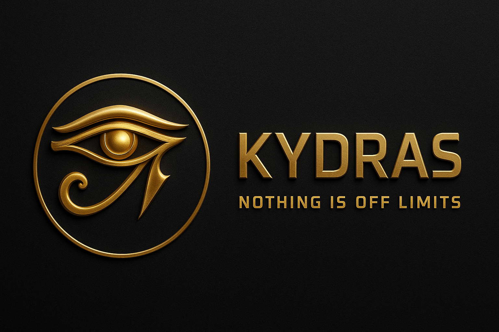

<!-- Kydras8 Profile README -->

  <!-- Replace with your own banner image if you commit one -->
  

<h1 align="center">⚡ Kydras Systems — NOTHING IS OFF LIMITS ⚡</h1>

  
  
  

> Independent dev • Red Team / OSINT • Building an ecosystem of cyber tools for real-world ops and learning.

---

## 🚀 What I’m Building
- **Kydras Echo** — AI-assisted transcription & analysis for investigations and research  
- **Kydras Suite / Total War Pack** — offensive automation, payload craft, workflow playbooks  
- **Kydras Push** — content distribution + subscription platform to grow the Kydras network

> 🛠 Mission: make powerful security tooling **accessible, affordable, and practical**.

---

## 💚 Support the Mission
Keeping the platform online + scaling integrations costs **$480/yr**.  
I set a **$1,000 GoFundMe** to cover infra + fees and keep releases flowing.

🔗 **Fund Kydras:** https://gofund.me/7d85cda2

**Perks**
- $10+ Early feature access  
- $25+ Credits in repo README  
- $50+ Priority beta invites  
- $100+ Private dev channel sneak peeks

---

## 🧰 Tech & Tools
**Languages:** Python, Bash, JavaScript  
**Stacks:** FastAPI, Flask, Node, SQLite/PostgreSQL  
**Ops:** Kali, Docker, GitHub Actions, Linux networking  
**Security:** Wi-Fi tooling, OSINT pipelines, red-team automation

  
  
  
  
  

---

## 📦 Featured Projects
| Project | What it does | Links |
|---|---|---|
| **Kydras Echo** | AI transcription/analysis for podcasts, calls, and field notes | [Repo](https://github.com/Kydras8/KydrasEcho) |
| **Kydras Suite** | Offensive tooling + automation + playbooks | [Repos](https://github.com/Kydras8?tab=repositories&q=Kydras) |
| **Kydras OSINT** | Lightweight OSINT collection & enrichment pipelines | [Repo](https://github.com/Kydras8/Kydras-OSINT) |
| **Mobile Pentest Kit** | Mobile-first pentest workflows, helpers, and scripts | [Repo](https://github.com/Kydras8/Kydras-Mobile-Pentest-Kit) |
| **eBook Studio** | Turn notes/scripts into clean eBooks (lite/pro tiers) | [Repo](https://github.com/Kydras8/Kydras-eBook-Studio) |

> Want a quick demo screenshot? Check each repo’s README.

---

## 🗺️ 2025 Roadmap (high-level)
- [ ] Echo: URL ingest, diarization, redaction helpers
- [ ] Suite: batch ops, queue runner, templated payloads
- [ ] Push: campaign scheduler + analytics
- [ ] CI: one-line installer, auto-packaging, signed releases

---

## 📈 Activity & Stats

  

  

---

## 🔗 Connect
- GoFundMe: **https://gofund.me/7d85cda2**
- GitHub: https://github.com/Kydras8
- (Optional) Website/Blog: https://kydras8.github.io

> **Signal boost helps** — a star, share, or small donation keeps the lights on.

---

  <!-- Replace with your logo if committed -->
  
   
  <i>“Nothing Is Off Limits.”</i>

